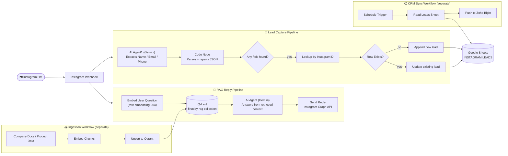
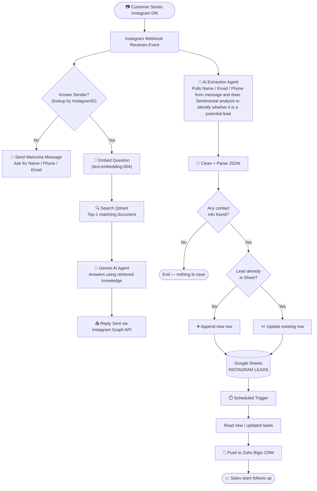

<div align="center">

###  Auto-Replies with Company Knowledge &nbsp;|&nbsp;  Captures Leads Automatically &nbsp;|&nbsp;  Syncs to CRM

</div>

<div align="center">

[](https://git.io/typing-svg)


</div>

---

## 🖼️ Live Demo & Workflow Screenshots

<div align="center">
<table>
<tr>
<td width="50%" align="center"><b>Main Workflow</b><br/></td>
<td width="50%" align="center"><b>Knowledge Ingestion Workflow</b><br/></td>
</tr>
<tr>
<td width="50%" align="center"><b>CRM Sync Workflow</b><br/></td>
<td width="50%" align="center"><b>Live Instagram Chat</b><br/></td>
</tr>
</table>
</div>

> 📁 Drop your exported PNGs into an `assets/` folder in the repo root with these exact filenames, and the images above will render automatically on GitHub.

---

## 📖 About the Project

**LeadPilot AI** automates the first line of customer conversation on a business Instagram account. Instead of a human replying to every "what's the price of X" DM, the system:

1. Listens for incoming Instagram DMs via a webhook.
2. Answers customer questions using the **company's own product knowledge**, via Retrieval-Augmented Generation (RAG) — not a generic or hallucinated AI answer.
3. Extracts a lead's **Name, Email, and Phone** from natural conversation and saves it to Google Sheets.
4. On a schedule, syncs captured leads into a CRM (**Zoho Bigin**) so the sales team can follow up.

Built with **n8n** as the orchestration layer, **Qdrant** as the vector database, and **Google Gemini** as the LLM, the project is a hands-on implementation of a production-style RAG pipeline — going from "how do I stop the AI from hallucinating company info?" to a working, self-hosted chat automation system.

---

## ✨ Key Features

| Feature | Description |
|---|---|
| 🧠 **RAG-Powered Replies** | Answers are grounded in real company data retrieved from Qdrant, not the model's general knowledge |
| 🔍 **Semantic Search** | Understands meaning, not just keywords — "good for photography" correctly matches a "200MP camera" listing |
| 📇 **Automatic Lead Extraction** | An LLM agent pulls Name / Email / Phone straight out of natural conversation — no forms required |
| 🔁 **Smart Upsert Logic** | New leads are appended, existing leads are updated without overwriting previously captured fields with nulls |
| 👋 **New User Onboarding** | Unknown senders get a welcome message requesting their details before the RAG flow engages |
| 🔄 **Scheduled CRM Sync** | Leads flow from Google Sheets into Zoho Bigin automatically, on a timer |
| 🧹 **Resilient Parsing** | A Code node cleans/repairs the LLM's JSON output so malformed responses never break the workflow |

---

## 🏗️ System Architecture



---

## 🔄 End-to-End Message Flow



---

## 🧠 How the RAG Pipeline Works

| Step | What happens |
|---|---|
| 1 | Customer sends: *"What is the price of Samsung S25?"* |
| 2 | Message is converted into an embedding via Google's `text-embedding-004` |
| 3 | That embedding is searched against the `firstday-rag` Qdrant collection |
| 4 | Qdrant returns the closest matching document — e.g. *Samsung S25 — ₹74,999, free Buds worth ₹5,999* |
| 5 | The retrieved text + original question is sent to Gemini as context |
| 6 | Gemini replies naturally, grounded only in that retrieved data |

**Why RAG at all?** The naive fix — stuffing all company data into every prompt — doesn't scale and burns through context limits. RAG instead retrieves only the *most relevant* snippet per question, keeping replies accurate and cheap. Several implementation options were evaluated (vector DB, local vector index via FAISS, hybrid keyword+vector search, SQL + `pgvector`) before settling on **Qdrant** for its fast semantic search and easy setup.

---

## 🗂️ Project Structure

```
LeadPilot-AI/
├── workflows/
│   ├── 1-main-instagram-rag-agent.json     # Webhook → RAG reply + lead capture
│   ├── 2-knowledge-ingestion.json          # Company data → embeddings → Qdrant
│   └── 3-crm-sync.json                     # Scheduled Google Sheets → Zoho Bigin
├── knowledge-base/
│   └── product-catalog.md                  # Source docs fed into the ingestion workflow
├── assets/
│   ├── workflow-1-main.png
│   ├── workflow-2-ingestion.png
│   ├── workflow-3-crm-sync.png
│   └── instagram-chat-demo.png
└── README.md
```

---

## 🧩 Core Nodes & Responsibilities (Main Workflow)

| Node | Role |
|---|---|
| `Instagram Webhook` | Receives incoming DMs; also handles Meta's webhook verification handshake |
| `Is User Known` | Checks if the sender's InstagramID already exists in the leads sheet |
| `Send Welcome Message` | Greets new senders and requests their contact details |
| `Embed User Question` | Converts the customer's message into a vector via `text-embedding-004` |
| `Search Qdrant` | Retrieves the closest matching knowledge-base document |
| `AI Agent` (Gemini) | Generates the reply, grounded strictly in retrieved context |
| `HTTP Request1` | Sends the AI's reply back via the Instagram Graph API |
| `AI Agent1` (Gemini) | Extracts Name / Email / Phone from the raw message as JSON and does sentiment analysis to find whether it is a potential lead|
| `Code in JavaScript` | Cleans and safely parses the extraction agent's JSON output |
| `Append row in sheet` / `Update row in sheet` | Upserts the lead into Google Sheets without erasing existing data |

---

## 🧰 Tech Stack

**Orchestration:** n8n
**LLM:** Google Gemini
**Embeddings:** Google `text-embedding-004`
**Vector Database:** Qdrant
**Data Processing:** Python / JavaScript (Code nodes)
**Lead Storage:** Google Sheets
**CRM:** Zoho Bigin
**Messaging Channel:** Instagram Graph API

---

## ⚙️ Getting Started

### Prerequisites
- A running n8n instance (self-hosted or cloud)
- A Qdrant instance (self-hosted or managed, e.g. Railway)
- Google Gemini API key
- Meta/Instagram Business account with Graph API access + a verified webhook
- Google Sheets API access (service account or OAuth)
- Zoho Bigin API credentials

### 1. Clone the repository
```bash
git clone https://github.com/<your-username>/LeadPilot-AI.git
cd LeadPilot-AI
```

### 2. Import the workflows into n8n
In your n8n instance: **Workflows → Import from File**, and import each file from `workflows/` in order (ingestion → main → CRM sync).

### 3. Configure credentials
Replace every hardcoded key in the imported workflows with proper n8n **Credentials**:
- Google Gemini API key
- Instagram Graph API access token
- Qdrant instance URL
- Google Sheets OAuth/service account
- Zoho Bigin API credentials

### 4. Set your Instagram webhook
Point your Meta App's webhook URL to the `Instagram Webhook` node's production URL, and set the verify token to match the `If` node's check.

### 5. Load your knowledge base
Run **Workflow 2** to embed and upsert your company's product/FAQ data into Qdrant before going live.

### 6. Activate
Turn on **Workflow 1** (main) and **Workflow 3** (scheduled CRM sync) in n8n.

---

## 🔐 Security Note

> ⚠️ Never commit API keys, access tokens, or webhook verify tokens directly inside exported workflow JSON. Use n8n's built-in Credentials system or environment variables, and add `workflows/*.json` to a review checklist before pushing to a public repo.

---

## 🚀 Future Enhancements

- **Lead scoring** — classify leads as High / Moderate / Low interest based on sentiment and buying intent
- **Low-interest lead retention** — log non-qualified conversations instead of discarding them
- **Production database migration** — move lead storage from Google Sheets to PostgreSQL / MySQL / MongoDB
- **Conversation-level sentiment analysis** — run once an inactivity timeout marks a conversation as complete

---

<div align="center">

[GitHub](https://github.com/<your-username>) · [LinkedIn](https://www.linkedin.com/in/<your-linkedin>)

</div>


